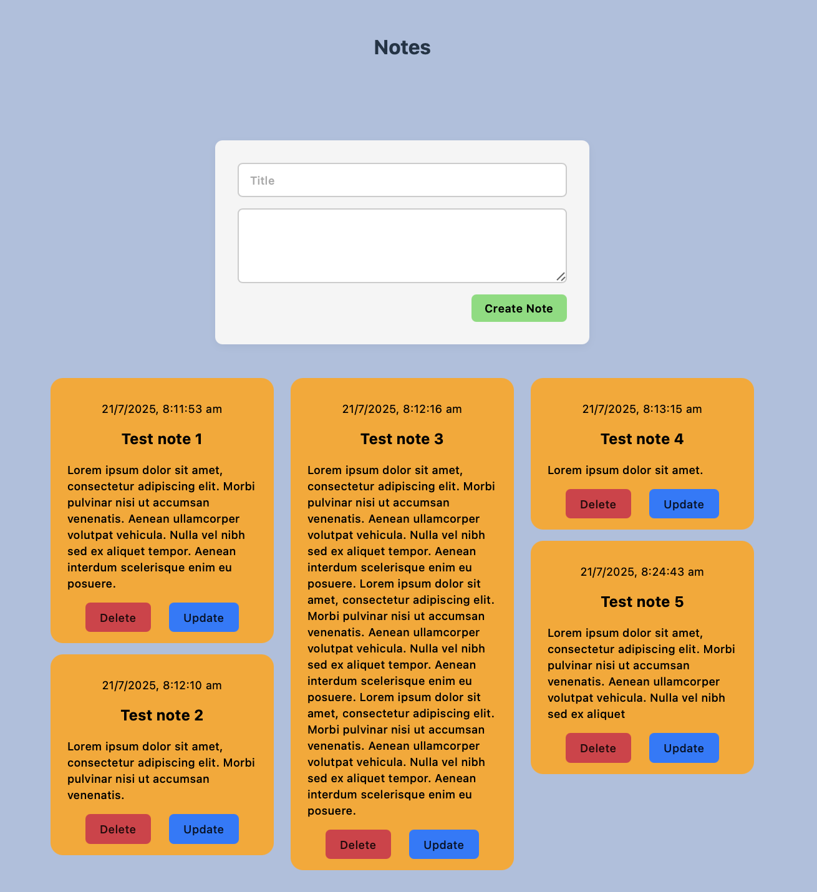
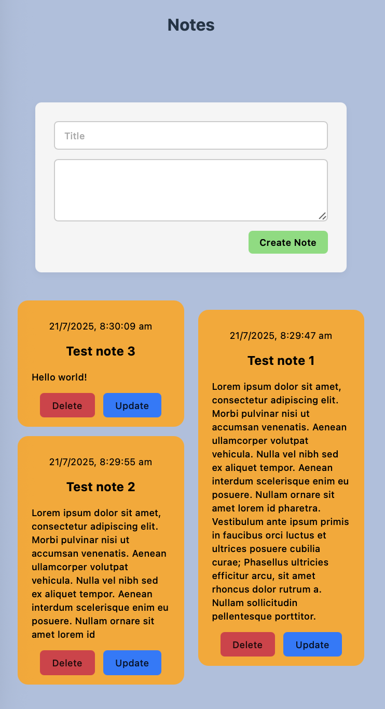
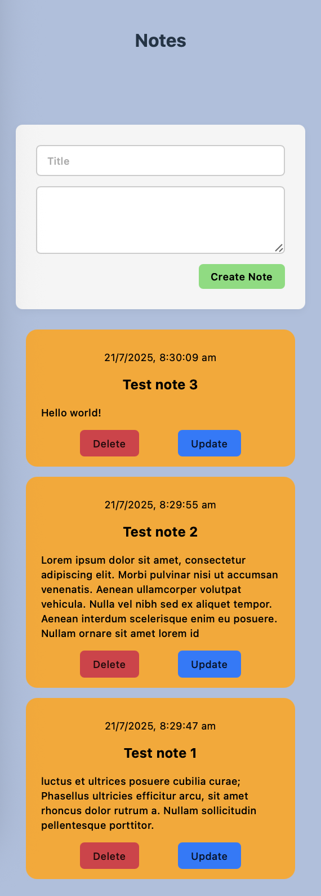

# Notes App 📝

A full-stack Java/Spring Boot + React notes app where you can create, view, delete personal notes.

The idea was to build a structure similar to [Google Keep](https://keep.google.com), with a Mason Jar layout where notes stack on top of each other to fill the whitespace created by larger notes.

## Stack

- [Backend](https://github.com/ColtonRandall/notes-app/tree/main/backend): Java 24 + Spring Boot
- [Frontend](https://github.com/ColtonRandall/notes-app/tree/main/frontend): React + Vite

## Features

- Create notes with a title and content
- View all notes
- Delete a note
- Update an existing note

## Layout

Full screen:

Tablet:

Mobile:

## Roadmap 

- [x] Basic CRUD operations
- [x] Add note creation timestamps
- [ ] Dark mode toggle
- [ ] Unit tests (JUnit - backend, Jest - frontend)
- [ ] Store note data in database
- [ ] Deploy to AWS
- [ ] Containerisation / Docker
- [ ] User authentication
