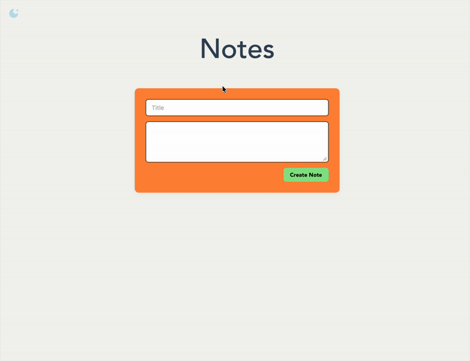
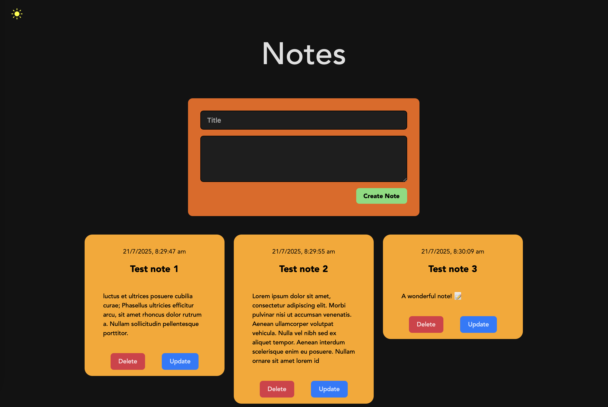
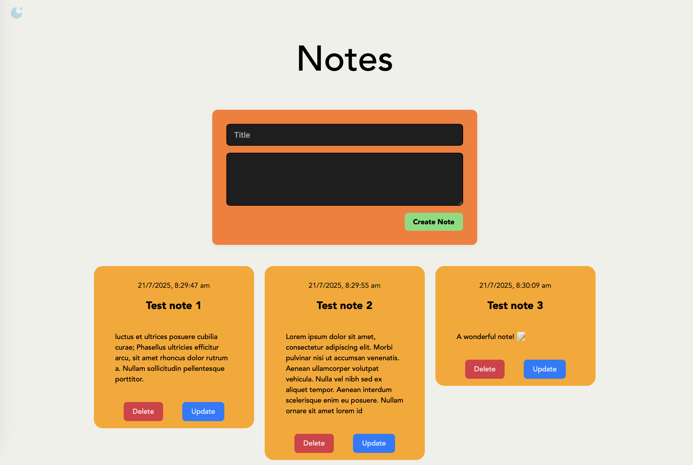
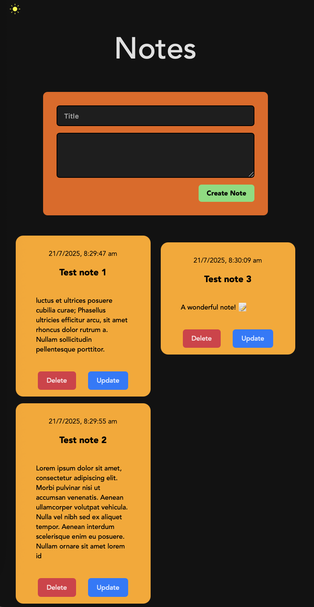
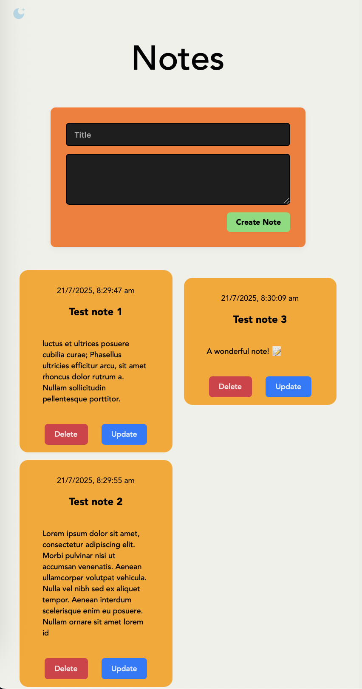
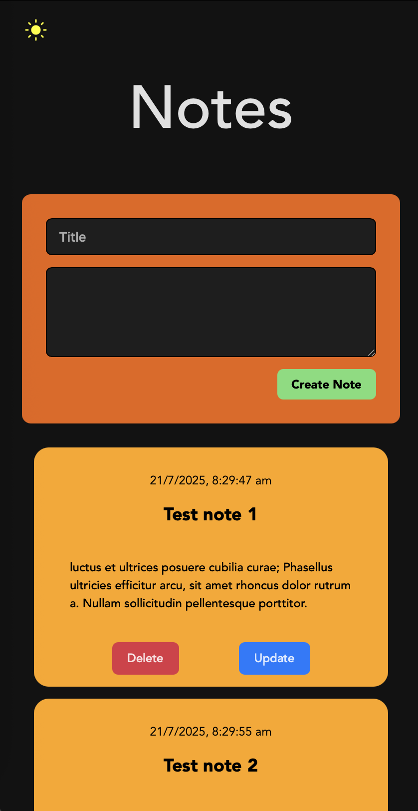
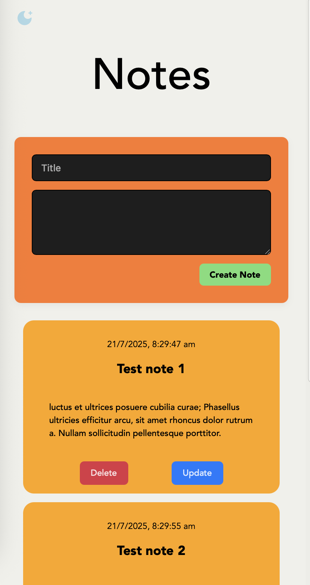

# Notes App 📝

A full-stack notes application built with Java 24 & Spring Boot (backend) and React + Vite (frontend).
Easily create, view, update, and delete personal notes with a clean, responsive UI inspired by Google Keep. Notes are arranged in a Mason Jar layout, dynamically stacking to utilize whitespace efficiently.

## Stack

- Backend: Java 24 + Spring Boot
- Frontend: React + Vite
- [Backend source code](https://github.com/ColtonRandall/notes-app/tree/main/backend)
- [Frontend source code](https://github.com/ColtonRandall/notes-app/tree/main/frontend)

## Features

- Create notes with a title and rich content
- View all existing notes in a Mason Jar layout
- Update existing notes seamlessly
- Delete unwanted notes
- Persistent data storage to retain notes after page reloads

## Layout

Full screen (dark):

Full screen (light):

Tablet (dark):

Tablet (light):

Mobile (dark):

Mobile (light):

## Roadmap

- [x] Basic CRUD operations
- [x] Add note creation timestamps
- [x] Dark mode toggle
- [ ] Unit tests (JUnit - backend, Jest - frontend)
- [ ] Store note data in database
- [ ] Deploy to AWS
- [ ] Containerisation / Docker
- [ ] User authentication
